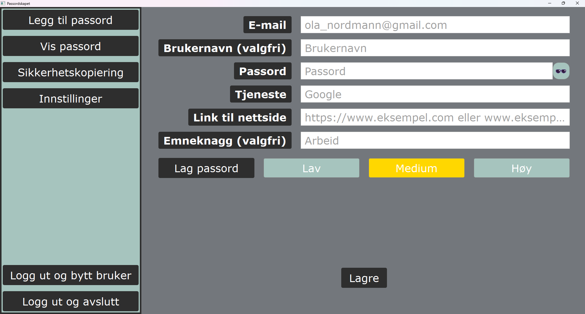
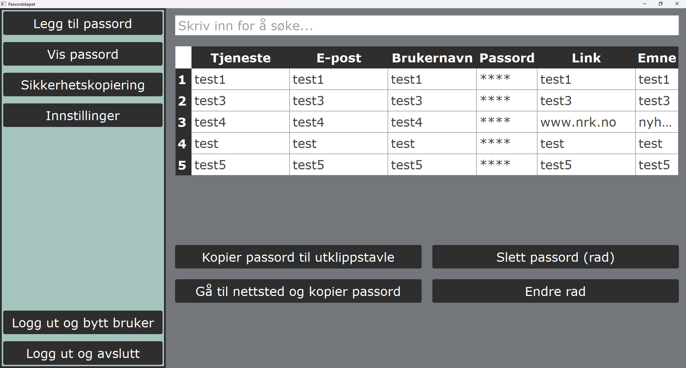
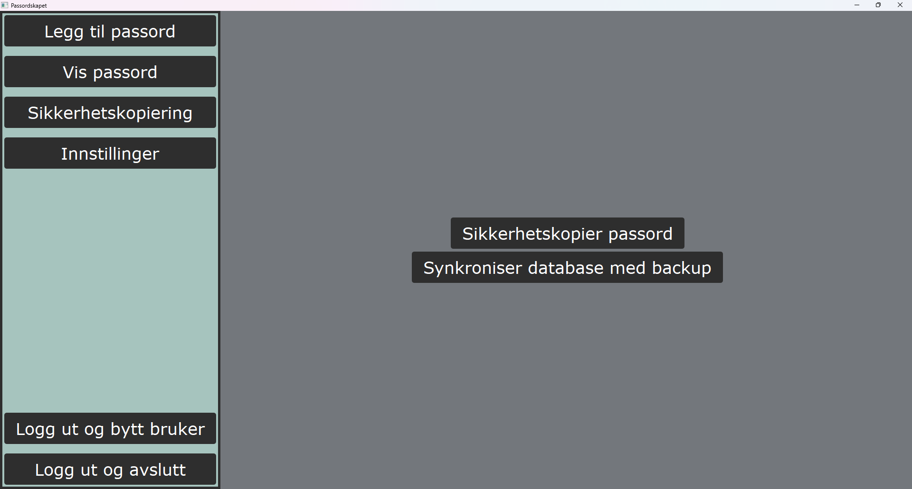
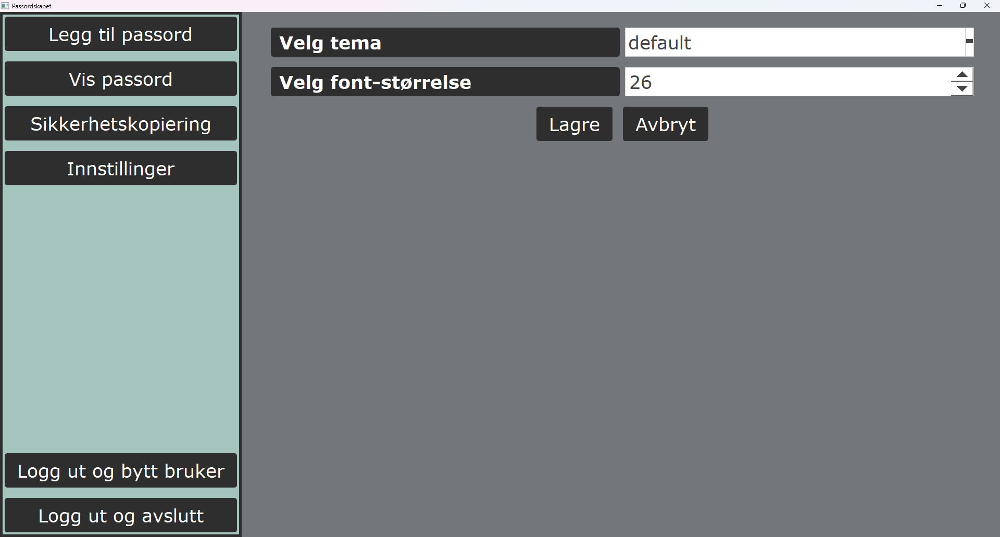

# PassordSkap

Dette er et personlig prosjekt for å øve på apputvikling. Denne appen er en passordlagrings app, som bruker PySide2, og er under utvikling. 

## Innholdsfortegnelse

1. [Plan for videreutvikling](#plan-for-videreutvikling)
2. [Funksjonalitet](#funksjonalitet)
3. [Liste over funksjoner som kan implementeres](#liste-over-funksjoner-som-kan-implementeres)
4. [Bilder fra app](#bilder-fra-app)
5. [Lisens](#lisens)
6. [Bidra](#bidra)
7. [Kontakt](#kontakt)
8. [Opphavsrett](#opphavsrett)

# Plan for videreutvikling
Det første man burde se på er om man klarer å gjøre key behandlingen mer internt. Per nå så deles key mellom forskjellige widget. Planen foreløpig er å gjøre key privat til login widget for så å lage en encryption helper som vi kan sende videre til de andre widgetene som kan hjelpe med å kryptere og dekryptere.

## Funksjonalitet
- Registrere flere brukere.
- Minimumslengde for passord til PassordSkapet.
- Brute force beskyttelse for innlogging.
- Lagre, søke/vise passord, kopiere innhold til utklippsbrett ved dobbeltklipp i tabell.
- Generere nye passord.
- Gå til nettside og kopiere passord fra tabell.
- Ta backup.
- Synkronisere mellom enheter ved hjelp av backup.
- Bytte farge tema i appen (bare default er implementert, men man kan lett legge til nye i styles.py THEMES).
- Endre på skriftstørrelse.
- Ta ut passordtabellen i klartekst i csv (For bruk i demo, slik at man slipper å dobbeltføre passord når man tester)

## Liste over funksjoner som kan implementeres
- add_password_widget: 
    - Bruker tilpasset ordbok for generering av nye passordfraser.
    - Filtrering på emne feltet i tabellen.
- settings_widget: Automatisk utlogging etter en gitt tid.
- Ny widget: En wiki for passordsikkerhte og appen.

## Bilder fra app
### Legg til passord

### Vis passord

### Backup

### Settings

## Lisens

Dette prosjektet er dual-lisensiert under følgende lisenser:

### 1. Åpen Kildekode Lisens (Non-Commercial)
PassordSkap er tilgjengelig for ikke-kommersiell bruk under [Creative Commons Attribution-NonCommercial 4.0 International License (CC BY-NC 4.0)](LICENSE-CC-BY-NC.txt). Dette tillater bruk, deling og modifikasjon av programvaren så lenge den ikke brukes kommersielt.

### 2. Proprietær Lisens
For kommersiell bruk, lisensiering eller andre spesialtilpasninger, vennligst kontakt meg på [stiankk@protonmail.com](mailto:stiankk@protonmail.com). En proprietær lisens må inngås for å bruke PassordSkap kommersielt.

## Bidra

Vi setter pris på bidrag! Vennligst se [CONTRIBUTING.md](CONTRIBUTING.md) for retningslinjer.

## Kontakt

For spørsmål, vennligst kontakt meg på [stiankk@protonmail.com](mailto:stiankk@protonmail.com).

## Opphavsrett

© 2024 skk. Alle rettigheter reservert.